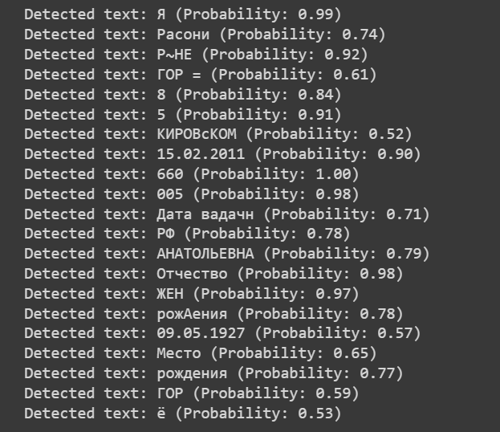
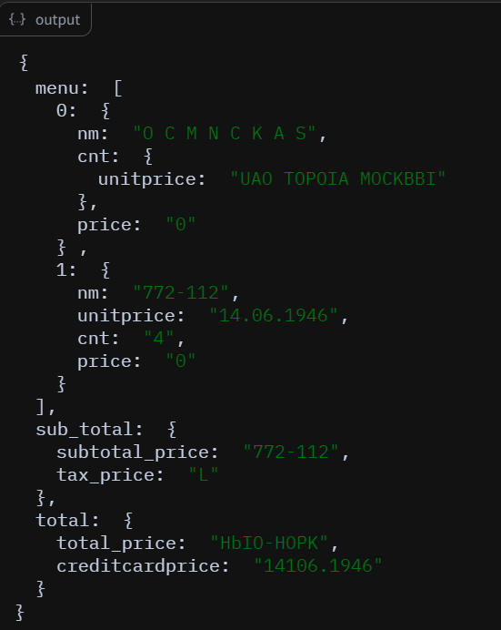

# 1. Обучение собственного алгоритма для распознавания ФИО с паспорта 
(не пользуясь готовыми библиотеками OCR, но пользуясь открытыми данными по распознаванию текста)  

Создан алгоритм, извлекающий буквы из изображения паспорта, для каждой буквы проведена классификация на основе модели, обученной на сгенерированном датасете из шрифтов.  

`Testovoe_OCR_pytorch.ipynb` - ноутбук с обучением модели.  
`Testovoe_OCR_def_pytorch.ipynb` - ноутбук с извлечением текста с изображения паспорта и распознаванием символов.  
`generate_letters_fonts_FINAL.py` - генерация датасета русских букв и цифр для обучения модели.  

## Обучение модели
Модель создана на основе обучающей документации на сайте фреймворка Pytorch https://pytorch.org/tutorials/beginner/blitz/cifar10_tutorial.html.  
Использована модель ResNet18, которая на тренирована на датасете imagenet-1k. Особенностью модели является residual block, который предотвратить затухание градиента при обучении модели и использовать большое количество слоев.  

Изменен входной сверточный слой для того, чтобы можно было передавать изображение с одним каналом.  
Также изменен выходной линейный слой для того, чтобы на выходе было 42 параметра, равному числу классов.  

График обучения модели:  
  

Аккуратность распознавания для каждого класса:  
  

## Извлечение букв  
Написана функция `def passport_preprocessing`, принимающая на вход изображение паспорта и возвращающая список из изображений букв по строкам размером 128х128, а также исходное изображение с нарисованными рамками, в котором распознаны контуры букв.  
Рамки нарисованы после превращения линий с текстом в сплошные линии методом `cv2.morphologyEx` библиотеки openCV и выделением полученных контуров.  
  
  

## Получение предсказаний
Классы предсказываются для каждой буквы после загрузки весов обученной модели, перевода модели в режим валидации.  
В результате получен тензор с предсказаниями, и выбран максимальная вероятность класса.  

Задачей является получение информации с полей ФИО, поэтому из списка всех распознанных слов, мы должны вернуть поля, которые идут после строки с кодом и датой выдачи паспорта.  
Для этого при помощи функции `def num_row` мы получаем первую строку с цифрами и обрезаем следующие три строки через одну.  

Полученный результат:   
В оригинале: Трамп Дональд Джон.  
   

## Способы улучшения точности предсказания:  
* Приблизить датасет для обучения модели к буквам в паспорте, или распознавать буквы в паспорте без выделения контуров. Для этого обучать модель на размытых буквах с фильтром `cv2.blur`  
* Изменить параметры модели, чтобы график потерь уменьшался с увеличением количества эпох (архитектуру, функцию потерь, оптимизатор)  
* Улучшить предобработку модели или использовать изображения паспортов с лучшим качеством  

# 2. Тестирование открытых библиотек по распознаванию документов.
## 1) EasyOCR
Популярная библиотека OCR с большим количеством поддерживаемых языков, простой установкой/  
Протестировано в Google Colab. Получены отличные результаты на изображении с хорошим качеством. На плохом качестве - средние результаты. На сайте распозналось гораздо хуже  
     

## 2) Tesseract
Tesseract - OCR библиотека с открытым доступом. Поддерживаются множество языков. Изначально разработана в компании HP.  
Протестировано в Google Colab. Русский язык не установился, на английском перевелось, не качество не 100%. Хуже, чем EasyOCR. При установке на Linux русский язык заработа сразу, но качество не улучшилось.  
   

## 3) PassportEye
Протестировано в Google Colab. Требует установки Tesseract. Получены неудовлетворительные результаты.

## 4) PaddleOCR 
Китайская библиотека. Есть распознавание онлайн. Распознает невероятно быстро, но не совсем точно.

## 5) Donut
OCR-free end-to-end Transformer, распознала за 5 минут. Но не на русском.  

## 6) docTR 
Протестировано в Google Colab. Результаты нормальные, но не было русского.  
 

Также доступны, но не протестированы:
* RUPassportRead
* FaceOnLive
* pasport_eye
* deepdoctection

## Выводы
В целом при использовании данных библиотек можно получить отличные результаты, на многих из них доступен русский язык.  
Плюсы по сравнению с готовыми программами: возможно подстраивать под свои нужды.  
Минусы: требуется большой датасет с необходимыми изображениями.  

# 3. API c помощью которых можно провести распознавание
Протестированы 3 программы, которые не требуют регистрации.  

## 1) Smart Engines Server OCR
Мобильное приложение, доступны разные варинты распознвания: камерой, загрузкой изображения.  
Высокое качество, распознало каждый элемент паспорта после сканирования камерой.  
  

## 2) OCRSpace
https://ocr.space/  
Протестировано на сайте. Качество хорошее, но не распознало русский.  
  

## 3) Problembo
https://problembo.com/ru/services/ocr-online  
На сайте. Не распознает многие поля. Поддерживает русский.    
  

## Выводы
Использование готовых программ не требует настройки и обучения, возможна интеграция со своими сервисами.  
Достоинства: Широкий выбор среди сервисов (Google Cloud, VK Cloud.Vision, ABBYY FineReader Engine, Yandex.Vision).  
Недостаток: цена в зависимости от выбора производителя.  

